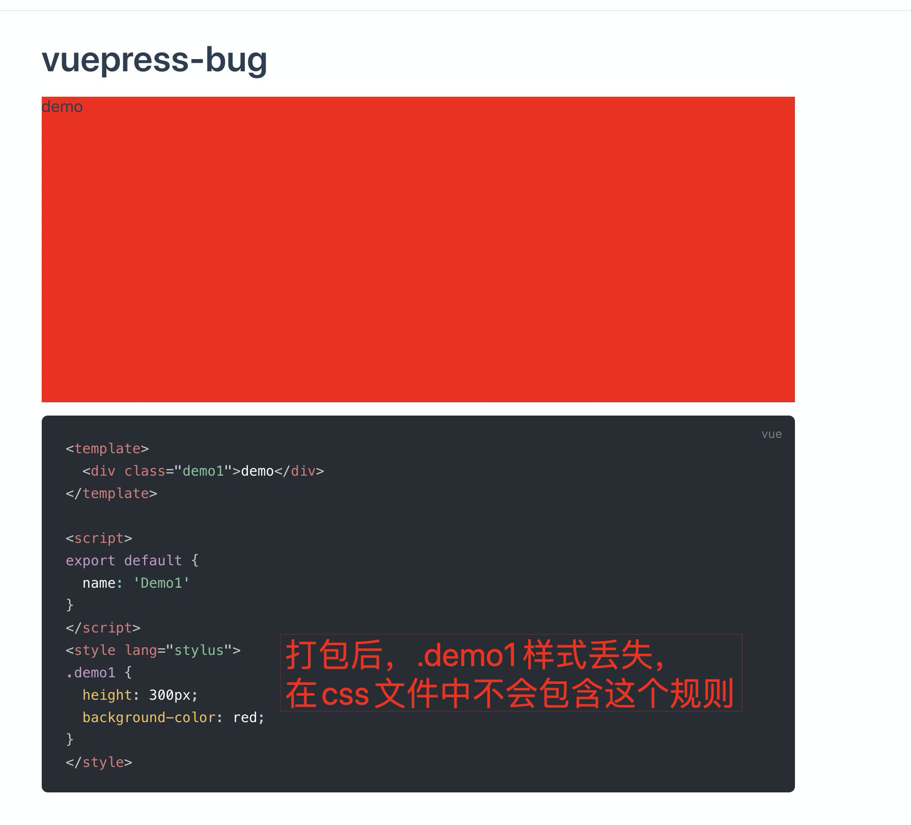

# vuepress-bug
vuepress 打包后样式丢失 bug

## 问题描述

`docs/.vuepress/components/Demo1.vue`中`style`标签中的样式打包后丢失，即部署之后，没有样式。开发时没有这个问题，只有在打包时会出现。

## 导致问题的原因

目前排查到问题是由于[项目下package.json](./package.json)中的`sideEffects`为`false`导致，去掉该字段或者修改为`true`都能正常工作，可修改字段打包后查看`docs/.vuepress/dist/assets/css`中的 css 文件进行对比

## 项目打包命令

```bash
# 启动开发
npm run dev

# 打包
npm run build
```

## 截图

